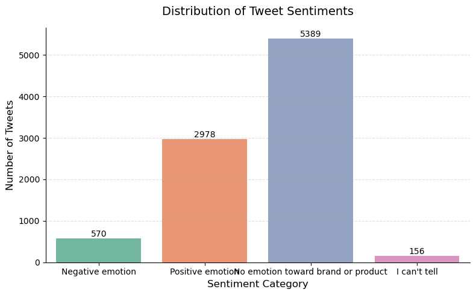
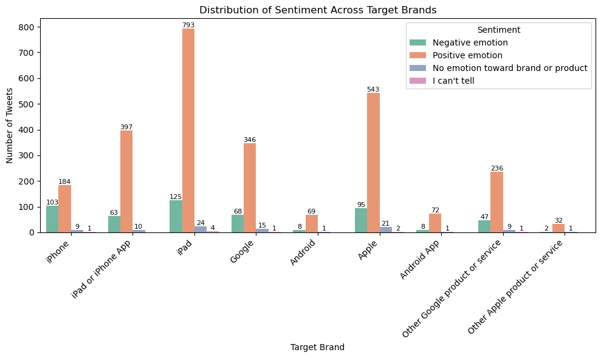
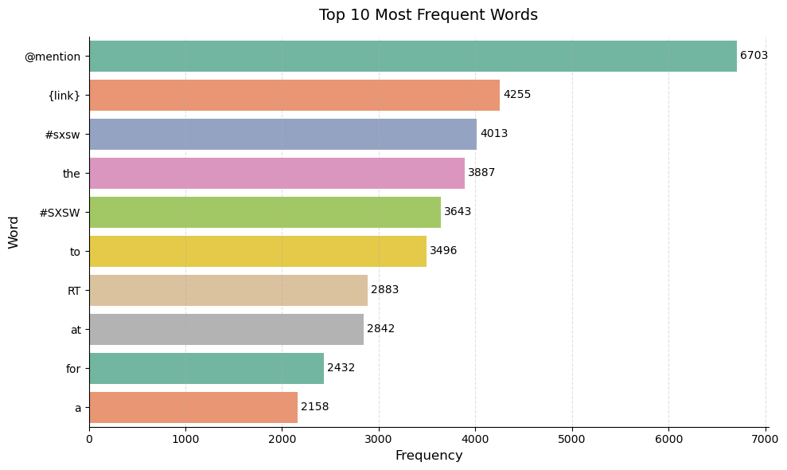
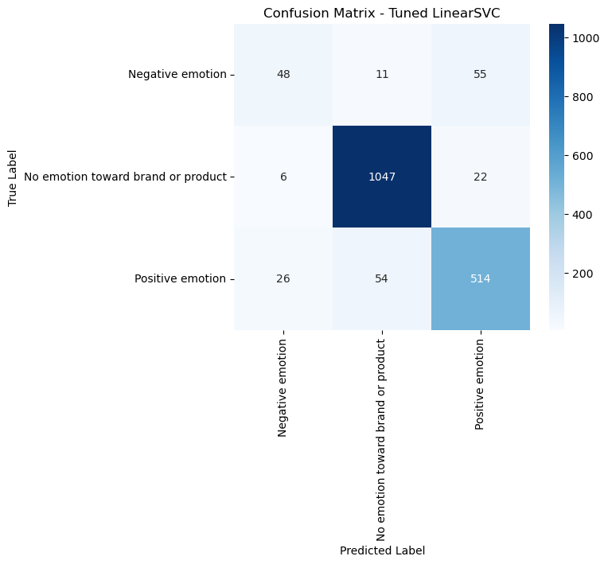
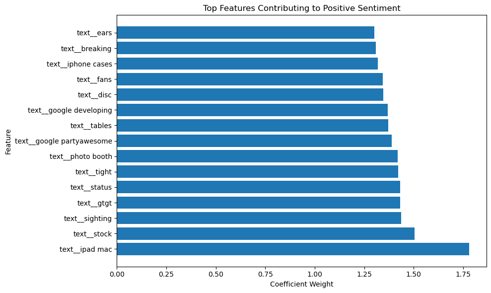

# Twitter Sentiment Analysis Using Machine Learning

## Overview

Social media platforms have become a major source of customer opinions and brand feedback. Organizations can leverage sentiment analysis to understand public perception, identify customer concerns, and make informed business decisions.

This project develops a machine learning solution that classifies tweets related to Apple and Google products into three sentiment categories:

* Positive Emotion
* Negative Emotion
* No Emotion Toward Brand or Product

The project applies Natural Language Processing (NLP), feature engineering, and supervised machine learning techniques to analyze tweet sentiment and identify the most effective classification model.

---

# Business Problem

Companies receive thousands of customer opinions daily through social media. Manually analyzing these comments is time-consuming and inefficient.

The objective of this project is to build a sentiment classification system capable of automatically categorizing tweets according to sentiment, enabling businesses to:

* Monitor customer satisfaction
* Detect negative feedback early
* Track brand perception
* Improve customer experience strategies
* Support data-driven decision making

---

# Dataset Description

The dataset contains tweets discussing Apple and Google products and services.

### Features

| Feature      | Description                   |
| ------------ | ----------------------------- |
| tweet        | Raw tweet text                |
| target_brand | Brand referenced in the tweet |
| sentiment    | Sentiment label               |

### Target Classes

* Positive Emotion
* Negative Emotion
* No Emotion Toward Brand or Product

---

# Data Cleaning and Preparation

To prepare the tweets for machine learning, several preprocessing steps were applied:

### Data Cleaning

* Removed missing values
* Removed ambiguous sentiment labels
* Consolidated brands into Apple and Google categories
* Standardized text formatting

### Text Preprocessing

The tweet text was cleaned through:

1. Lowercasing
2. URL removal
3. Username removal
4. Hashtag cleaning
5. Emoji removal
6. Punctuation removal
7. Stopword removal
8. Lemmatization

This reduced noise and improved feature quality for model training.

---

# Exploratory Data Analysis

Several visualizations were created to understand the data before modeling.

## Sentiment Distribution

The sentiment distribution revealed a clear class imbalance, with neutral tweets dominating the dataset and negative tweets representing the smallest class.



### Key Insight

Class imbalance suggested that accuracy alone would not be sufficient for evaluating model performance. Macro F1-score and recall became important metrics for assessing minority class performance.

---

## Brand Sentiment Analysis

Sentiment was analyzed across Apple and Google brands.



### Key Insight

Both brands exhibited similar sentiment trends, with neutral sentiment accounting for the majority of observations.

---

## Most Frequent Words

TF-IDF preprocessing and word frequency analysis identified common discussion themes.



### Key Insight

The most frequently occurring words highlighted the main topics discussed by users and provided early indicators of sentiment-related vocabulary.

---

# Feature Engineering

Two types of features were created:

## Text Features

TF-IDF Vectorization

Parameters tuned during experimentation included:

* Maximum features
* N-gram range
* Minimum document frequency

## Brand Features

One-Hot Encoding was applied to the target_brand variable.

Both feature sets were combined using a ColumnTransformer pipeline.

---

# Machine Learning Models

The following models were evaluated:

## Logistic Regression

Used as the baseline model because:

* Works well on sparse text data
* Computationally efficient
* Easy to interpret

---

## Logistic Regression (Balanced)

Applied class weighting to address class imbalance.

---

## Multinomial Naive Bayes

A lightweight probabilistic model commonly used in text classification tasks.

---

## Linear Support Vector Machine (LinearSVC)

Selected because SVMs are highly effective for high-dimensional text classification problems.

---

## Tuned LinearSVC

Hyperparameter optimization was performed using GridSearchCV.

Parameters tuned included:

* TF-IDF n-grams
* TF-IDF vocabulary size
* Minimum document frequency
* Regularization parameter (C)

Evaluation was based on Macro F1-score to ensure fair treatment of minority classes.

---

# Model Comparison

| Model                          | Strengths                   | Weaknesses                    |
| ------------------------------ | --------------------------- | ----------------------------- |
| Logistic Regression            | High accuracy               | Poor minority-class detection |
| Logistic Regression (Balanced) | Improved recall             | Slightly reduced precision    |
| Multinomial Naive Bayes        | Fast and simple             | Lower overall performance     |
| LinearSVC                      | Strong balanced performance | Less interpretable            |
| Tuned LinearSVC                | Best overall results        | Higher training complexity    |

### Best Model

The tuned LinearSVC achieved the strongest balance between overall accuracy and minority-class performance.

---

# Model Evaluation

## Classification Report

Key evaluation metrics included:

* Accuracy
* Precision
* Recall
* F1-score
* Macro F1-score

The tuned LinearSVC achieved approximately:

* Accuracy: 90.6%
* Macro F1-Score: 0.78

---

## Confusion Matrix



### Interpretation

The model classified neutral and positive tweets effectively.

Negative sentiment remained the most difficult class due to class imbalance and overlapping vocabulary. However, performance improved substantially compared to the baseline Logistic Regression model.

---

# Model Interpretation

Understanding why a model makes predictions is critical.

## Feature Importance

LinearSVC coefficients were analyzed to identify influential features.



### Insight

Certain words strongly influenced positive, negative, and neutral sentiment predictions, helping explain model behavior.

---

## LIME Explanations

LIME was used to explain individual tweet predictions.


### Insight

LIME highlighted the specific words contributing to each sentiment prediction, improving transparency and trust in the model.

---

# Key Findings

* Most tweets expressed neutral sentiment.
* Negative sentiment was the least represented class.
* Class imbalance significantly affected baseline models.
* Text preprocessing improved model performance.
* LinearSVC outperformed Logistic Regression and Naive Bayes.
* Hyperparameter tuning improved minority-class detection.
* The final model achieved strong overall performance while maintaining reasonable balance across classes.

---

# Recommendations

Based on the findings:

1. Deploy the tuned LinearSVC model for sentiment monitoring.
2. Collect additional negative sentiment examples to improve class balance.
3. Retrain the model periodically using new social media data.
4. Monitor negative sentiment trends as early indicators of customer dissatisfaction.
5. Explore transformer-based models such as BERT for future improvements.

---

# Technologies Used

* Python
* Pandas
* NumPy
* Matplotlib
* Seaborn
* Scikit-Learn
* NLTK
* LIME
* Jupyter Notebook

---

# Repository Structure

```text
.
├── data/
├── images/
│   ├── sentiment_distribution.png
│   ├── brand_sentiment.png
│   ├── top_words.png
│   ├── confusion_matrix.png
│   ├── feature_importance.png
│   └── lime_example.png
├── notebooks/
│   └── Twitter_Sentiment_Analysis.ipynb
├── README.md
├── requirements.txt
└── .gitignore
```

---

# Conclusion

This project demonstrates how Natural Language Processing and Machine Learning can be used to automatically classify social media sentiment. Through extensive preprocessing, feature engineering, model comparison, and hyperparameter tuning, the tuned LinearSVC model emerged as the most effective solution.

The resulting system provides a practical framework for monitoring customer sentiment and supporting data-driven business decisions.


## Author

Chariy Nduati

Data Science & Machine Learning Enthusiast

